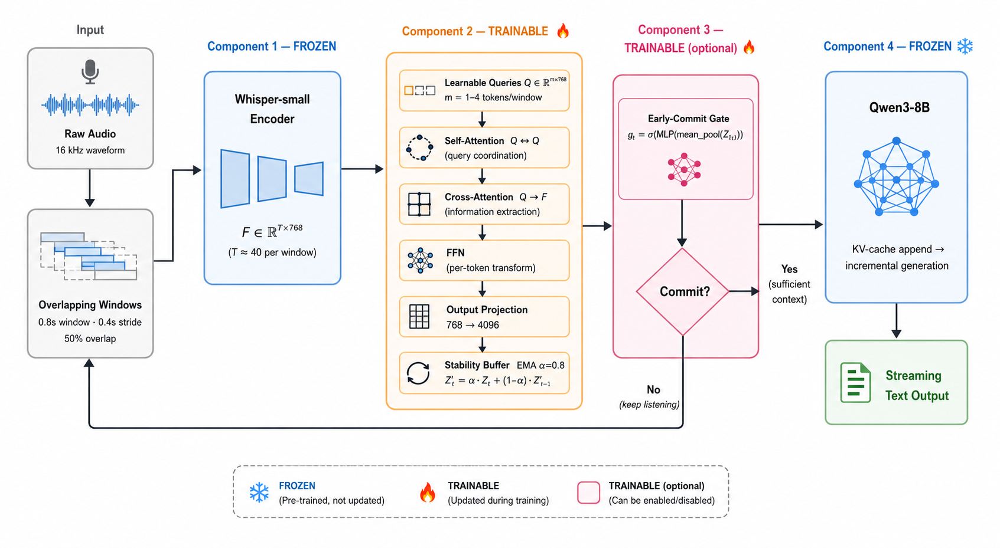
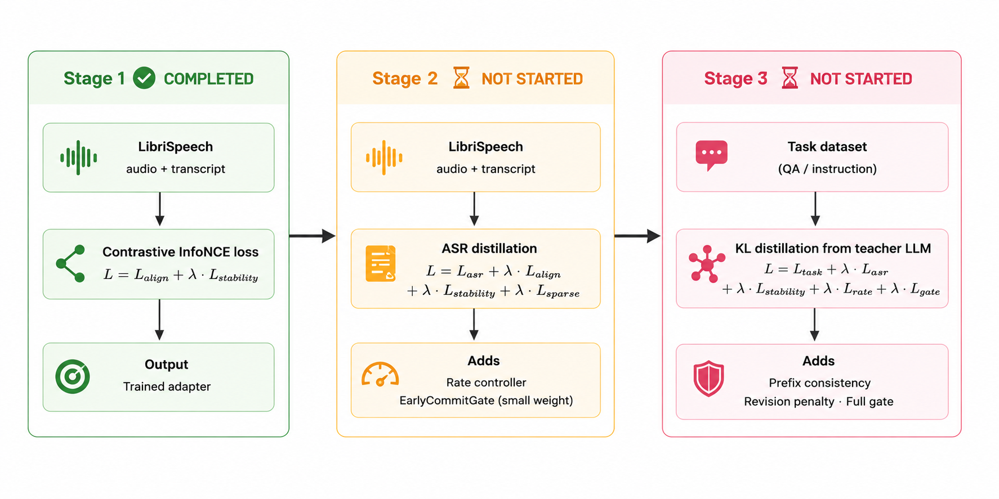

# Audio Streaming Adapter — Research & Implementation

## Table of Contents

1. [Problem Statement](#1-problem-statement)
2. [Solution Overview](#2-solution-overview)
3. [System Architecture (4 Components)](#3-system-architecture-4-components)
4. [Streaming Pipeline](#4-streaming-pipeline)
5. [Component 2: Streaming Adapter Network](#5-component-2-streaming-adapter-network)
6. [Component 3: Early-Commit Gate](#6-component-3-early-commit-gate)
7. [Loss Functions by Training Stage](#7-loss-functions-by-training-stage)
8. [Stage 1: Contrastive Audio–Text Alignment](#8-stage-1-contrastive-audiotext-alignment)
   - [The Cone Collapse Problem](#81-the-cone-collapse-problem)
   - [The Fix: Batch Centering](#82-the-fix-batch-centering)
9. [Stage 2: Content Preservation (ASR Distillation)](#9-stage-2-content-preservation-asr-distillation)
10. [Stage 3: Task Distillation (Streaming)](#10-stage-3-task-distillation-streaming)
11. [Evaluation Strategy](#11-evaluation-strategy)
12. [Baseline: SALMONN-7B](#12-baseline-salmonn-7b)
    - [What SALMONN Does Well](#121-what-salmonn-does-well)
    - [Why Cosine Retrieval is Misleading for SALMONN](#122-why-cosine-retrieval-is-misleading-for-salmonn)
    - [Evaluation Script](#123-evaluation-script)
13. [Our System vs. SALMONN Baseline](#13-our-system-vs-salmonn-baseline)
14. [Key Differences Summary](#14-key-differences-summary)
15. [Theoretical Foundation](#15-theoretical-foundation)
16. [Related Work](#16-related-work)
17. [Current Status](#17-current-status)

---

## 1. Problem Statement

Audio encoders (e.g. Whisper) produce dense frame sequences at tens of frames per second. Feeding these frames directly into small language models (LLMs) causes two fundamental problems:

1. **Context explosion**: 2 minutes of audio produces 3,000+ encoder frames — far beyond what a small LLM can hold in context.
2. **Latency**: The LLM must wait for the entire audio stream before generating any response.

Neither batch speech-to-text (ASR pipeline → LLM) nor direct frame injection is suitable for real-time, low-latency audio-LLM interaction.

---

## 2. Solution Overview

A **streaming adapter network** that compresses continuous audio into a low-bitrate, append-only token stream (1–3 tokens/sec) that a frozen small LLM can consume in real-time.

```
Target compression: ~3000 frames → ~240 tokens over 2 minutes (≈ 12.5× reduction)
Target latency: sub-window first-token (< 0.8s from speech onset)
```

Only the adapter (and optionally the early-commit gate) are trained. The audio encoder and LLM remain completely frozen throughout all stages.

---

## 3. System Architecture (4 Components)



**Current LLM**: Qwen3-8B. The system is LLM-agnostic by design — swapping requires only a dimension change in the output projection.

---

## 4. Streaming Pipeline

```
Window params: 0.8s window / 0.4s stride (50% overlap)
Target rate:   1–3 tokens/window → ~1–3 tokens/sec
```

Per window, the pipeline executes:

1. Raw audio is split into overlapping windows (0.8s, stride 0.4s)
2. Frozen Whisper encoder → frame features F ∈ R^{T × D_enc} (T ≈ 40 for 0.8s, D_enc = 768 for Whisper-small)
3. Trainable adapter compresses each window → m tokens (1–4 per window, optionally adaptive)
4. Tokens appended to LLM context via KV-cache (no re-encoding)
5. Early-commit gate polls accumulated tokens → triggers LLM generation when confident
6. LLM generates early and continues updating as more tokens arrive

**Data flow (full resolution):**

```
Raw Audio (16 kHz waveform)
  ↓  [0.8s windows, 0.4s stride]
Audio Window (12 800 samples)
  ↓  [Component 1: Frozen Whisper-small encoder]
Frame Features F ∈ R^{T × 768}
  ↓  [Component 2: Streaming Adapter]
  │   Q-Former layers (self-attn + cross-attn + FFN)
  │   Optional rate controller (soft gating at train / hard at inference)
  │   Output projection (768 → 4096 for Qwen3-8B)
  │   Stability buffer (EMA smoothing, α ≈ 0.8)
Compressed Tokens Z ∈ R^{m × 4096}   (m = 1–4, optionally adaptive)
  ↓  [Component 3: Early-Commit Gate]
  │   Commit probability g_t = σ(MLP(mean_pool(Z_{1:t})))
  ↓  [Component 4: Frozen Qwen3-8B]
  │   Append Z to KV-cache
  │   Incremental generation
Streaming Output (text tokens)
```

---

## 5. Component 2: Streaming Adapter Network

**Implementation**: `src/adapter/streaming_adapter.py`

### Q-Former Layer (BLIP-2 Style)

Each layer (`src/adapter/cross_attention.py::QFormerLayer`) has three sub-layers:

| Sub-layer | Operation | Purpose |
|-----------|-----------|---------|
| Self-Attention | Q ↔ Q | Queries coordinate to avoid redundancy |
| Cross-Attention | Q → F | Queries extract information from encoder frames |
| FFN | Per-token nonlinear | Expressiveness / feature transformation |

### Why Cross-Attention with Learnable Queries?

| Option | Problem |
|--------|---------|
| Average pooling | Destroys temporal order — "hello world" = "world hello" |
| Strided CNN | Rigid, content-independent — silence gets same weight as phonemes |
| Q-Former (chosen) | Content-adaptive; queries specialize via self-attention; decoupled from input length |

### Cross-Attention Layer Placement

`StreamingAdapter` supports interleaving self-attention-only layers between cross-attention layers via `cross_layer_in_between = K`:

- `K = 0`: Every layer uses cross-attention (full Q-Former stack)
- `K = 1`: Period P = 2; cross-attention on layers 1, 3, 5, … (layer 0 is self-only)
- Pattern: layer `i` uses cross-attention iff `i % (K+1) == K`

### Stability Buffer (EMA)

**Mechanism**: `Z'_t = α · Z_t + (1 − α) · Z'_{t-1}`,  α ≈ 0.8

**Why EMA**:
- Recency bias: Old windows decay — correct for causal streaming
- No added parameters (or one scalar α if learnable)
- Causal: Depends only on past windows, never future
- Proven: Analogous to batch norm running stats

**Mechanism vs. Loss** (these are separate):
- **EMA** is the inference-time smoothing mechanism
- **Stability loss** `L_stability = Σ_t ||Z_t − Z_{t-1}||²` is the training signal that penalises large jumps between adjacent windows

### Adaptive Token Rate Controller (Optional)

`src/adapter/rate_controller.py`

Dynamically selects how many of the m query slots to activate per window:

- Silence → 1 token
- Dense speech → 3–4 tokens

Losses produced:
- `L_sparse`: L1 on gate scores — encourages using fewer tokens
- `L_rate`: MSE between effective token count and target rate R

Inference uses hard thresholding; training uses soft gating.

---

## 6. Component 3: Early-Commit Gate

**Implementation**: `src/adapter/early_commit_gate.py`

> **This is NOT the rate controller.** They solve different problems.

| | Rate Controller | Early-Commit Gate |
|---|---|---|
| Question | "How many tokens for THIS window?" | "Should the LLM START generating?" |
| Scope | Per-window | Per-stream |
| Part of | Component 2 (adapter, optional) | Component 3 (separate module) |
| Loss | L_sparse + L_rate | L_gate |

The gate operates on accumulated tokens Z_{1:t}:

```python
g_t = σ(MLP(mean_pool(Z_{1:t})))   # commit probability ∈ [0, 1]
```

**L_gate** balances two opposing penalties:

- **Accuracy penalty**: Committing before enough context → poor LLM output
- **Latency penalty**: Committing late → unnecessarily high first-token latency

```python
# Latency penalty component (from early_commit_gate.py)
position = timestep / max(total_timesteps - 1, 1)   # normalised ∈ [0, 1]
latency_penalty = latency_weight * position * (1.0 - commit_prob).mean()
```

Full `L_gate` requires the task loss to backpropagate through the gate so that committing too early also produces a task-accuracy penalty.

---

## 7. Loss Functions by Training Stage

### Training Pipeline Overview



### Complete Loss Inventory

| Loss | Stage introduced | What it does |
|------|-----------------|-------------|
| `L_align` | Stage 1 | InfoNCE contrastive — audio tokens vs. text embeddings |
| `L_stability` | Stage 1 | MSE(Z_t, Z_{t-1}) — temporal smoothness |
| `L_asr` | Stage 2 | Frozen causal LM loss with teacher-forced text |
| `L_sparse` | Stage 2 | L1 on rate controller gates — fewer tokens when possible |
| `L_rate` | Stage 2 | MSE between effective token count and target rate R |
| `L_gate` | Stage 3 | Latency–accuracy tradeoff for early-commit gate |
| `L_task` | Stage 3 | KL divergence from teacher LLM distribution |
| Prefix consistency | Stage 3 | P(y \| Z_{1:t}) ≈ P(y \| Z_{1:t+k}) |
| Revision penalty | Stage 3 | Penalise changing earlier generated output |

**Note**: Prefix consistency and revision penalty require the LLM in the forward pass; they are implemented in the training loop, not in the adapter module.

---

## 8. Stage 1: Contrastive Audio–Text Alignment

**Status: Completed.**

**Goal**: Align adapter-produced audio tokens to frozen LLM text embeddings using contrastive learning. No text transformer is run inside the adapter — only the LLM embedding layer.

**Loss**:

```
L = L_align + λ_stability · L_stability
```

**Inputs**: LibriSpeech `(audio_path, transcription)` pairs.

**Core forward pass**:

```
waveform
  → WhisperWindowFeatureExtractor (0.8s / 0.4s segments)
  → StreamingAdapter.forward_window() per segment
  → concatenate tokens across segments
  → mean pool → (batch-center) → L2-normalize → audio_vec

transcription
  → tokenizer
  → LLM embedding layer only (frozen)
  → mean pool → (batch-center) → L2-normalize → text_vec

L_align = InfoNCE(audio_vec, text_vec)
```

**Checkpoint**: `checkpoints/adapter_adapter.pt`

---

### 8.1 The Cone Collapse Problem

During initial Stage 1 training, the contrastive loss was not learning. Diagnostics showed:

| Metric | Value | Problem |
|--------|-------|---------|
| `neg_sim` | 0.40 | Random unrelated pairs had 40% cosine similarity before training |
| `pos_sim` | flat at 0.65 | Positives could not separate from negatives |
| `pos_minus_neg` | flat at 0.25 | No real contrastive signal |
| `train/align` loss | stuck at ln(4) ≈ 1.38 | Loss was not decreasing |
| `text_std` | 0.008 | Embedding cloud was heavily squashed |

**Root cause: anisotropy of LLM embeddings.**

Transformer language models trained on next-token prediction produce highly anisotropic token embeddings. All word vectors cluster inside a narrow cone — the "common direction of language":

```
         ___
        /   \     ← all word vectors live in here
       / ••• \
      / ••••• \
     /•••••••••\
    /___________\
          |
          | "common direction" (anisotropy bias)
          ↓
```

When you mean-pool any sentence, the average lands near the cone's centre — regardless of content:

```
mean("the cat sat") ≈ cone centre
mean("the dog ran") ≈ cone centre
mean("hello world") ≈ cone centre
```

The model was asked "which audio matches which text?" but every text vector was already 40% identical to every other one. The actual content differences were drowned in shared "language-ness."

This is a well-documented property of transformer LM embeddings:
- **Ethayarajh (2019)** — first showed BERT/GPT embeddings are highly anisotropic
- **Gao et al. (2021)** — SimCSE: showed mean-pooled LM embeddings cluster too tightly for similarity without correction
- **Su et al. (2021)** — proposed full whitening (centering + decorrelation) as a stronger variant

---

### 8.2 The Fix: Batch Centering

**Four lines of code. Zero new parameters.**

Before computing contrastive loss, subtract the batch mean from both the audio and text pooled vectors:

```python
# File: training/utils/losses.py
# Function: contrastive_infonce_loss

# Before (broken):
a = F.normalize(audio_tokens.float().mean(dim=1), dim=-1)
t = F.normalize(text_embeddings.float().mean(dim=1), dim=-1)

# After (fixed):
a_pooled = audio_tokens.float().mean(dim=1)
t_pooled = text_embeddings.float().mean(dim=1)
a_pooled = a_pooled - a_pooled.mean(dim=0, keepdim=True)   # remove common direction
t_pooled = t_pooled - t_pooled.mean(dim=0, keepdim=True)
a = F.normalize(a_pooled, dim=-1)
t = F.normalize(t_pooled, dim=-1)
```

**Effect**: Moves every point so the cloud is centered at the origin. Random pairs now average to near-zero similarity; the meaningful pair-by-pair differences become visible.

| Metric | Before centering | After centering |
|--------|-----------------|----------------|
| `text_std` | 0.008 | 0.015 |
| `audio_std` | 0.012 | 0.0156 |
| `neg_sim` | 0.40 | ~0 |
| `pos_sim` | flat at 0.65 | climbing 0 → 0.45 |
| `pos_minus_neg` | flat at 0.25 | climbing 0 → 0.5 |
| `train/align` loss | stuck at 1.38 | 2.05 → 1.4 and dropping |

**The same centering fix is applied in `eval_retrieval.py` at evaluation time** to ensure training and evaluation metrics are consistent.

**What to watch in future contrastive runs**: If `neg_sim` sits well above zero, suspect anisotropy. Check `pooled.std(dim=0).mean()` — it should be near `1/sqrt(D)` (≈ 0.0156 for D=4096). If centering is insufficient at scale, next steps are: projection heads (SimCLR-style MLP), full whitening, or learned attention pooling.

---

## 9. Stage 2: Content Preservation (ASR Distillation)

**Status: Not yet started.**

**Goal**: Make adapter tokens sufficient for accurate ASR when fed into the frozen LLM. Adds ASR distillation on top of the Stage 1 alignment objective.

**Loss**:

```
L = L_asr + λ_align · L_align + λ_stability · L_stability + λ_sparse · L_sparse
```

**New in Stage 2**:
- `L_asr`: Frozen causal LM loss. Audio tokens are prepended to the LLM context; the LLM predicts the correct transcript in teacher-forced mode. Gradients flow back through the adapter only (LLM stays frozen).
- Optional `AdaptiveRateController` introduced for token efficiency (`L_sparse`).
- `EarlyCommitGate` trained jointly (gate loss contribution is small; primary focus is content fidelity).

---

## 10. Stage 3: Task Distillation (Streaming)

**Status: Not yet started.**

**Goal**: Full streaming training with early commitment. Distil knowledge from a frozen text-only teacher LLM into the streaming audio system.

**Loss**:

```
L = L_task + λ_asr · L_asr + λ_stability · L_stability + λ_rate · L_rate + λ_gate · L_gate
```

**New in Stage 3**:
- `L_task`: KL divergence between the audio-conditioned LLM distribution and the teacher text-only LLM distribution.
- Prefix consistency: P(y | Z_{1:t}) ≈ P(y | Z_{1:t+k}) — earlier predictions should not change as more audio arrives.
- Revision penalty: Penalises the LLM for retracting or contradicting earlier generated tokens.
- `EarlyCommitGate` is trained to full effect with the task loss backpropagating through the commit decision.

---

## 11. Evaluation Strategy

We evaluate on **three axes** to separately measure what the adapter has learned:

### Axis 1: Retrieval (audio → text alignment)

Given N audio clips and their N transcripts, rank all transcripts for each audio by similarity. The correct transcript should rank first.

**Metrics**: R@1, R@3, R@5, R@10, MRR, Median Rank

**Scoring modes**:

| Mode | Description | When to use |
|------|-------------|-------------|
| Cosine | Dot product of pooled + centered + L2-normalized embeddings | Our system (Stage 1+) |
| NLL | Negative log-likelihood of transcript under LLM conditioned on audio prefix | After Stage 2; also for SALMONN baseline |

Cosine retrieval is O(N) per query after embedding; NLL retrieval is O(N²) over the query set — use smaller N for NLL.

**Implementation**:
- Our system: `evaluation/eval_retrieval.py` (cosine), `evaluation/eval_retrieval_nll.py` (NLL)
- SALMONN baseline: `salmonn/SALMONN-7B/eval_librispeech_full_metrics.py`

### Axis 2: ASR quality (WER / BLEU)

Generate transcript end-to-end (audio → adapter tokens → LLM → text). Compute word error rate and BLEU-4 against the LibriSpeech reference.

**Metrics**: avg WER, corpus BLEU-4

### Axis 3: Streaming / latency

- First-token latency (time from audio onset to first generated token)
- Stability: revision rate, prefix-consistency score

---

## 12. Baseline: SALMONN-7B

We use [SALMONN-7B](https://github.com/bytedance/SALMONN) as our primary baseline for LibriSpeech test-clean evaluation.

**Evaluation script**: `salmonn/SALMONN-7B/eval_librispeech_full_metrics.py`

SALMONN architecture:
- **Audio encoder 1**: Whisper **Large-v2** (frozen) — speech / ASR-style features
- **Audio encoder 2**: **BEATs** (frozen) — general audio event / non-speech features
- **Bridge**: Window-level Q-Former (BLIP-2 style) that receives the **concatenation** of both encoder outputs — batch processing, not streaming
- **LLM**: Vicuna **7B** or **13B** (frozen)

SALMONN's Q-Former input dimension is `Whisper_d_model + BEATs_encoder_embed_dim` (see `model.py::init_speech_Qformer`). This dual-encoder design is intended to give the model complementary representations: Whisper captures fine-grained phonetic/prosodic structure, while BEATs captures event-level acoustic features useful for non-speech audio tasks.

### 12.1 What SALMONN Does Well

SALMONN was designed for audio question-answering, not streaming retrieval. Given an audio clip and a prompt, it produces semantically correct, contextually appropriate text responses. Its LLM is a full Vicuna model with strong language understanding, and its Q-Former effectively bridges Whisper + BEATs and Vicuna for content-level tasks.

The dual-encoder input (Whisper + BEATs) is a key strength for general audio tasks — BEATs was pretrained on AudioSet with a masked audio modelling objective and provides rich non-speech representations that Whisper alone misses (e.g. environmental sounds, music, speaker emotion).

### 12.2 Why Cosine Retrieval is Misleading for SALMONN

SALMONN uses two separate representation spaces:
- **Audio side**: speech_llama_proj(QFormer(audio)) → Vicuna hidden space
- **Text side**: Vicuna embed_tokens(transcript) → the same Vicuna hidden space

Despite sharing the LLM embedding dimension, these two representations are **not aligned for cosine similarity**. The audio Q-Former projection was trained with a task-completion objective, not a contrastive embedding objective. The resulting audio vectors and text token embedding vectors do not form a joint metric space — cosine similarity between them is not meaningful.

**Expected behaviour on cosine retrieval**: Low R@1 even if SALMONN correctly understands the audio content. This is not a failure of the model — it is a measurement artefact from using the wrong retrieval mode.

### 12.3 Evaluation Script

`eval_librispeech_full_metrics.py` runs both retrieval modes and full ASR in one pass:

```bash
CUDA_VISIBLE_DEVICES=0,1 python eval_librispeech_full_metrics.py \
  --extract_dir /path/to/librispeech_test_clean \
  --ckpt_path ./checkpoints/salmonn_7b_v0.pth \
  --whisper_path openai/whisper-large-v2 \
  --beats_path ./checkpoints/beats.pt \
  --vicuna_path lmsys/vicuna-7b-v1.5 \
  --vicuna_device_map auto \
  --output_dir ./outputs/librispeech_baseline \
  --num_samples 500 \
  --retrieval_mode nll \
  --retrieval_nll_batch_size 8 \
  --partial_save_every 10
```

**Outputs** (all JSON, no `.pt` files):

| File | Contents |
|------|----------|
| `retrieval_metrics_{cosine,nll}.json` | R@1/3/5/10, MRR, median rank (standard and centered variants) |
| `retrieval_pairs_{cosine,nll}.json` | Per-utterance top-k ranked transcripts with scores |
| `asr_metrics.json` | avg WER, BLEU-4 |
| `asr_predictions.json` | Per-utterance reference, prediction, WER |
| `combined_metrics.json` | All metrics in one file |
| `partial_retrieval/partial_retrieval_nll_k{N}.json` | Rolling partial checkpoints (metrics + sim rows as lists) |

**For SALMONN, use `--retrieval_mode nll`** as the primary retrieval metric. NLL measures how well the model's audio representation supports predicting the correct transcript under the LLM — this reflects the model's actual audio understanding regardless of whether audio and text embeddings are aligned in cosine space.

---

## 13. Our System vs. SALMONN Baseline

The key architectural and methodological differences:

### Audio Encoder

| | SALMONN | Ours |
|---|---|---|
| Encoder 1 | Whisper **Large-v2** | Whisper **small** |
| Encoder 2 | **BEATs** (audio event encoder) | **None — removed** |
| Q-Former input | Whisper_dim + BEATs_dim (concatenated) | Whisper_dim only |
| Encoder parameters | ~1.5B (Whisper-L) + ~90M (BEATs) | ~244M (Whisper-small) |
| Whisper output dim | 1280 | 768 |
| Latency | Higher (two encoders, larger Whisper) | Lower (one small encoder) |
| Rationale | Rich multi-modal audio features, offline QA | Low latency, speech-focused, streaming |

**Removal of BEATs**: Our system deliberately drops the BEATs encoder. SALMONN feeds the concatenation of Whisper and BEATs outputs into its Q-Former (`input_dim = Whisper_d_model + BEATs_encoder_embed_dim`). BEATs was pretrained on AudioSet with a masked audio modelling objective and provides rich non-speech representations (environmental sounds, music, speaker emotion) that Whisper's speech-optimised encoder misses. For SALMONN's broad audio-QA scope this dual-encoder design is beneficial. For our speech-only evaluation on LibriSpeech, BEATs does not contribute content that Whisper does not already capture — including it would add ~90M frozen parameters, a second encoder pass per window, and a hard dependency on the `beats.pt` checkpoint, with no expected gain on speech tasks. Removing BEATs simplifies the pipeline, reduces inference cost, and is consistent with the low-latency goal.

The trade-off is that our system is currently speech-specialised. If the scope expands to general audio tasks (sound events, music, etc.), a second encoder analogous to BEATs could be reintroduced as a second input branch to the adapter Q-Former.

Using Whisper-small rather than Large-v2 is a further deliberate latency choice. If the adapter + smaller single encoder achieves competitive downstream performance, this provides strong justification for the overall low-latency design.

### Language Model

| | SALMONN | Ours |
|---|---|---|
| Model | Vicuna **7B / 13B** | **Qwen3-8B** (current) |
| Context | Full utterance | Incremental (KV-cache streaming) |
| Design goal | Rich semantic QA | Low-latency streaming response |
| Flexibility | Fixed | LLM-agnostic by design |

We are evaluating smaller LLMs (e.g. Phi, Qwen3-4B) for further latency reduction. A smaller LLM that performs comparably to Vicuna-7B on audio tasks would provide additional justification for the streaming / low-latency design.

### Attention Mechanism

| | SALMONN | Ours |
|---|---|---|
| Type | Full bidirectional attention (batch Q-Former) | Q-Former + considering **monotonic attention** |
| Streaming | No — requires full audio upfront | Yes — window-by-window |
| Temporal constraint | None (attends over all frames) | Causal; future frames unavailable |

**Monotonic attention** (MoChA / monotonic chunkwise attention) is a candidate upgrade for Stage 2/3. It enforces a left-to-right alignment constraint between the input sequence (audio frames) and the query sequence — directly matching the causal structure of streaming audio processing.

### Training Objective

| | SALMONN | Ours |
|---|---|---|
| Primary alignment | Task-completion (instruction following) | **Contrastive** (explicit audio–text metric space) |
| Retrieval | NLL only (not designed for cosine) | Both cosine (Stage 1+) and NLL (Stage 2+) |
| Streaming support | None | Yes, by design (stability loss, EMA, commit gate) |
| Latency objective | None | Early-commit gate (Stage 3) |

### Key Improvements Over SALMONN

1. **Contrastive learning**: Explicit audio–text alignment loss creates a proper joint metric space. Unlike SALMONN's task-completion objective, our Stage 1 model is specifically optimised to produce audio vectors that are close to their matching text vectors and far from non-matching ones. This enables meaningful cosine retrieval.

2. **Removal of BEATs encoder**: SALMONN uses two encoders (Whisper Large-v2 + BEATs) whose outputs are concatenated before the Q-Former. We remove BEATs entirely. For speech-only tasks on LibriSpeech, BEATs adds ~90M parameters and a second encoder pass without contributing features that Whisper does not already provide. The single-encoder design reduces model size, removes the `beats.pt` dependency, and lowers per-window inference cost — all directly supporting the low-latency goal.

3. **Streaming support with monotonic attention** (planned): SALMONN requires complete audio before processing. Our adapter processes each 0.8s window causally, accumulating tokens in the LLM's KV-cache without re-encoding prior windows.

4. **Low latency**: The entire system (Whisper-small, single encoder, 2-layer Q-Former, Qwen3-8B) is designed around the sub-second first-token latency target. Whisper-small, no BEATs pass, shallow adapter, and KV-cache streaming all contribute.

5. **Early-commit gate**: SALMONN always waits for the full audio. Our gate learns to trigger generation as soon as sufficient context is accumulated, trading off latency against accuracy in a learned, data-driven way.

---

## 14. Key Differences Summary

| Dimension | SALMONN (baseline) | Our System |
|-----------|-------------------|------------|
| Audio encoder 1 | Whisper Large-v2 | Whisper **small** |
| Audio encoder 2 | **BEATs** (audio events) | **None — removed** |
| Encoder dim | 1280 + BEATs_dim | **768** |
| LLM | Vicuna 7B / 13B | **Qwen3-8B** (swappable) |
| Processing mode | Full-utterance batch | **Window streaming** |
| Attention | Full bidirectional | Q-Former, considering **monotonic** |
| Alignment training | Task-completion only | **Contrastive** (Stage 1) |
| Streaming | ✗ | ✓ |
| Early-commit | ✗ | ✓ |
| Cosine retrieval | Not meaningful | ✓ (by design) |
| NLL retrieval | ✓ (meaningful) | ✓ (Stage 2+) |
| Latency objective | ✗ | ✓ |
| BEATs dependency | Required (`beats.pt`) | **Removed** |

---

## 15. Theoretical Foundation

**Information Bottleneck**: The adapter minimises `I(Audio; Tokens)` while maximising `I(Tokens; Task)` — compress aggressively but preserve task-relevant information.

**Compression ratio**: 25× reduction (T frames → m tokens; e.g. ~50 Whisper frames → 2 adapter tokens per 0.8s window).

**Prefix Consistency**: `P(y | Z_{1:t}) ≈ P(y | Z_{1:t+k})` — LLM predictions should not flip as new audio tokens arrive.

**Rate-Distortion**: Target R = m/t tokens/window while maintaining `I(Audio; Tokens) ≈ I(Audio; Text)`.

---

## 16. Related Work

| System | Relationship |
|--------|-------------|
| **SALMONN** (Tang et al. 2023) | Our primary baseline. Window-level Q-Former; we extend to streaming with stability objectives. |
| **BLIP-2 / Flamingo** | Q-Former / Perceiver resampler concept; we adapt to causal streaming audio. |
| **MoChA** (Chiu & Raffel 2018) | Monotonic chunkwise attention — candidate for Stage 2/3 attention replacement. |
| **Moshi / Mini-Omni / LLaMA-Omni** | Low-latency speech interaction systems; serve as latency benchmarks. |
| **SimCSE** (Gao et al. 2021) | Contrastive sentence embeddings; motivates our centering fix for anisotropy. |
| **Ethayarajh (2019)** | Characterised LM embedding anisotropy (cone collapse). |

---

## 17. Current Status

| Stage | Status | Notes |
|-------|--------|-------|
| Stage 1: Contrastive alignment | **Completed** | Centering fix applied; contrastive signal confirmed learning |
| Stage 1 evaluation | **In progress** | Cosine retrieval on LibriSpeech test-clean |
| SALMONN baseline eval | **In progress** | Running `eval_librispeech_full_metrics.py` — NLL retrieval + ASR (WER/BLEU) on LibriSpeech test-clean |
| Stage 2: ASR distillation | Not started | Depends on Stage 1 eval results |
| Stage 3: Task distillation | Not started | Depends on Stage 2 |

### Planned Evaluation Protocol

Once the SALMONN baseline run completes, we will establish baseline numbers for:

| Metric | Mode | Tool |
|--------|------|------|
| R@1, R@5, R@10, MRR | NLL retrieval | `eval_librispeech_full_metrics.py` |
| avg WER | ASR generation | `eval_librispeech_full_metrics.py` |
| corpus BLEU-4 | ASR generation | `eval_librispeech_full_metrics.py` |

Our Stage 1 system will then be evaluated on the same test set with:

| Metric | Mode | Tool |
|--------|------|------|
| R@1, R@5, R@10, MRR | **Cosine** retrieval | `eval_retrieval.py` |
| R@1, R@5, R@10, MRR | NLL retrieval | `eval_retrieval_nll.py` |

SALMONN NLL numbers serve as the baseline for NLL retrieval and ASR. SALMONN cosine numbers are expected to be low and are reported only for completeness — they do not reflect SALMONN's audio understanding capability.
