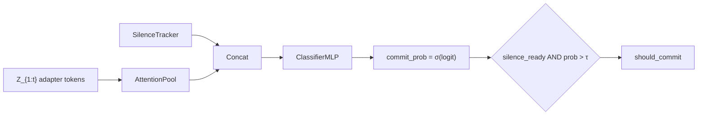

# Turn-End Commit Gate

Component 3 of the audio streaming adapter pipeline: an **integrated turn-end detector**
that replaces separate VAD + SmartTurn stages and triggers LLM generation when the user
stops speaking.

See also: [`AUDIO_STREAM.md`](AUDIO_STREAM.md) §6 for how this fits the four-component architecture.

---

## 1. Motivation

Traditional voice-agent stacks:

```
User stops → VAD (Silero) → SmartTurn (separate model) → encode audio → adapter → LLM
```

Latency after turn-end = VAD + turn model + full Whisper encode + adapter + first LLM token.

**Unified pipeline**:

```
While user speaks → Whisper (frozen) → adapter → append tokens to LLM KV-cache
Each window       → TurnEndCommitGate on Z_{1:t}
Turn ends         → should_commit → LLM generate (stream text)
```

Latency after turn-end ≈ **gate inference (tiny MLP) + first LLM token**, because encoding
is amortized during speech.

| | Separate VAD + SmartTurn | TurnEndCommitGate |
|---|---|---|
| Input | Raw audio / silence | Accumulated adapter tokens `Z_{1:t}` |
| Question | "Turn complete?" | "Turn complete → start LLM?" |
| When it runs | After silence | Every window during streaming |
| Cost at turn-end | Full encode + classify | Attention pool + classifier |

---

## 2. Architecture

**File**: `src/adapter/turn_end_commit_gate.py`  
**Class**: `TurnEndCommitGate`

Adapted from [Smart Turn V3](https://huggingface.co/pipecat-ai/smart-turn-v3) (`VAD/smart-turn/train.py`):
same attention-pool + classifier head, but operates on **adapter token sequences** instead
of Whisper mel features.



| Layer | Smart Turn V3 | TurnEndCommitGate |
|---|---|---|
| Encoder | WhisperEncoder on mel | *(upstream adapter output)* |
| **Silence tracking** | Built-in :class:`SilenceTracker` on per-window token activity ``Z_t`` |
| Input shape | `(B, T, d_model)` | `(B, N, d_llm)` + silence features `(B, 3)` |
| Pool | Linear → Tanh → Linear → softmax | Same |
| Classifier | LayerNorm MLP → logit | MLP on ``concat(pooled, silence_features)`` |
| Output | P(turn complete) | P(turn complete) + silence gating → trigger LLM |

### Previous design (reference)

The original mean-pool MLP gate lives in `src/adapter/early_commit_gate.py` (commented out):

```python
# g_t = σ(MLP(mean_pool(Z_{1:t})))
```

It optimized a generic latency–accuracy tradeoff without explicit turn-end supervision.
`EarlyCommitGate` is now a backward-compatible alias for `TurnEndCommitGate`.

---

## 3. Pipeline behavior

Per streaming window (0.8s window / 0.4s stride):

1. Raw audio chunk → frozen Whisper encoder → frame features
2. Streaming adapter → compressed tokens `Z_t` (1–4 tokens/window)
3. Append `Z_t` to accumulated sequence and LLM KV-cache
4. Update ``SilenceTracker`` from window audio (or external VAD) → VAD features
5. ``TurnEndCommitGate(accumulated, t, T, silence_tracker=..., window_tokens=Z_t)`` → `commit_prob`, `should_commit`
6. If `should_commit`: call LLM `generate()` and stream text tokens
7. Otherwise: continue listening for next audio chunk

**Inference (batch)**: ``WhisperAdapterLLMCommitGatePipeline.generate(...)``

**Inference (streaming KV-cache)**: ``WhisperAdapterLLMCommitGatePipeline.generate_streaming(...)``
or :class:`adapter_llm_streaming.WhisperAdapterStreamingSession` for live chunks.

```python
pipeline = WhisperAdapterLLMCommitGatePipeline(
    ...,
    early_commit_gate=gate,
)
result = pipeline.generate_streaming(waveform, train_style_asr=True)
# result["first_token_time_s"], result["early_commit_commit_probs"], result["committed_on_gate"]
```

---

## 3.1 Combining VAD + turn detection

The gate **combines both signals** instead of requiring a separate Silero + SmartTurn stack.

### Two layers

| Layer | Class | Question |
|---|---|---|
| **Silence / VAD** | `SilenceTracker` | Is there speech activity in this window's tokens `Z_t`? |
| **Turn-end** | `TurnEndCommitGate` classifier | Is this silence a **turn handoff** or a backchannel? |

### Cascade rule (inference)

```python
should_commit = (commit_prob > threshold) and silence_tracker.silence_ready
```

- **`silence_ready`**: not in speech and trailing silence ≥ `min_silence_ms` (default 200 ms)
- Blocks commit **during active speech** even if turn probability is high
- Turn head still rejects backchannels ("ok", "yes") when trained on Smart Turn labels

### Joint classifier input

Silence features (dim=3) are concatenated with attention-pooled **accumulated** tokens.
Per-window silence state is updated from **this window's** adapter tokens ``Z_t`` (not raw audio):

```python
[silence_indicator, silence_duration_norm, activity_prob]  # from token activity of Z_t
```

### Usage (token-based — default)

```python
from adapter.turn_end_commit_gate import TurnEndCommitGate, SilenceTracker

gate = TurnEndCommitGate(d_llm=4096, require_silence_for_commit=True)
tracker = gate.make_silence_tracker()

for t, step in enumerate(adapter_windows):
    accumulated = torch.cat(all_tokens[: t + 1], dim=1)  # Z_{1:t}
    result = gate(
        accumulated,
        t,
        total_windows,
        silence_tracker=tracker,
        window_tokens=step["tokens"],  # Z_t — already encoded audio
    )
    if result["should_commit"].item():
        break  # → LLM generate
```

Set ``GATE_REQUIRE_SILENCE=0`` to disable the silence AND-gate (turn probability only).

---

## 4. Training

### Loss (`L_gate`)

```python
gate_loss = bce_loss(endpoint_label, logits) + latency_penalty
```

- **BCE**: Smart Turn-style, batch-balanced `pos_weight`
- **Latency penalty** (optional): penalizes low `commit_prob` late in the utterance

### Label sources

Set via `GATE_LABEL_SOURCE` (see `training/utils/config.py` → `GateConfig`).

#### Synthetic (default)

Used in Stage 2/3 trainers on LibriSpeech full utterances:

- All windows except the last: `endpoint_label = 0`
- Final window: `endpoint_label = 1`

No extra dataset dependency.

#### Smart Turn (optional)

Set `GATE_LABEL_SOURCE=smart_turn`:

- Dataset: `src/dataset/smart_turn_gate.py` → `SmartTurnGateDataset`
- Default HF id: `pipecat-ai/smart-turn-data-v3.2-train`
- Each clip provides `endpoint_bool` (1 = turn complete, 0 = incomplete)
- Stage 2: dedicated gate-only fine-tune path (adapter frozen)
- Stage 3: gate-only loop when smart_turn mode is active

Env vars:

| Variable | Default | Description |
|---|---|---|
| `GATE_LABEL_SOURCE` | `synthetic` | `synthetic` or `smart_turn` |
| `SMART_TURN_DATASET` | `pipecat-ai/smart-turn-data-v3.2-train` | HF dataset id |
| `SMART_TURN_SPLIT` | `train` | Dataset split |
| `SMART_TURN_MAX_SAMPLES` | *(none)* | Cap clips for debugging |
| `GATE_HIDDEN_DIM` | `256` | Pool/classifier hidden size |
| `GATE_THRESHOLD` | `0.5` | Inference commit threshold |
| `GATE_LATENCY_WEIGHT` | `0.1` | Latency penalty weight |
| `GATE_MIN_SILENCE_MS` | `200` | Min trailing silence for `silence_ready` |
| `GATE_REQUIRE_SILENCE` | `1` | Require silence before `should_commit` |
| `GATE_TOKEN_ACTIVITY_THRESHOLD` | `8.0` | Mean token L2 norm for speech activity |

### Trainers

| Script | Gate integration |
|---|---|
| `training/adapter_asr_trainer.py` | Joint adapter + gate (synthetic); or Smart Turn gate-only branch |
| `training/adapter_task_trainer.py` | Joint training (synthetic); or Smart Turn gate-only branch |

Gate is evaluated on **full** `accumulated_tokens` including the current window at every
timestep `t`.

---

## 5. Checkpoint migration

Checkpoint key remains `gate_state_dict`.

**Old mean-pool gate weights are incompatible** with `TurnEndCommitGate` (different
parameter names/shapes). Trainers use `load_gate_state_dict_safe()` and warn on mismatch,
leaving the gate randomly initialized until re-trained.

Re-train Stage 2 (or run Smart Turn gate fine-tune) after upgrading.

---

## 6. Comparison summary

| | SmartTurn V3 | Old EarlyCommitGate | TurnEndCommitGate |
|---|---|---|---|
| Input | Raw audio (mel) | Adapter tokens | Adapter tokens |
| Architecture | Whisper + pool + MLP | Mean pool + MLP | Attention pool + MLP |
| Training labels | `endpoint_bool` | Latency penalty only | BCE on endpoint + optional latency |
| Role in stack | Separate turn detector | Generic early commit | Integrated turn-end + silence gating |
| Implementation | `VAD/smart-turn/` | `early_commit_gate.py` (deprecated) | `turn_end_commit_gate.py` |

---

## 7. Token-only design

All silence and turn-end signals come from adapter tokens:

- **`accumulated_tokens`** (`Z_{1:t}`) → turn-end classifier
- **`window_tokens`** (`Z_t`) → :class:`SilenceTracker` activity + trailing silence

No raw waveforms or external VAD in this component.
